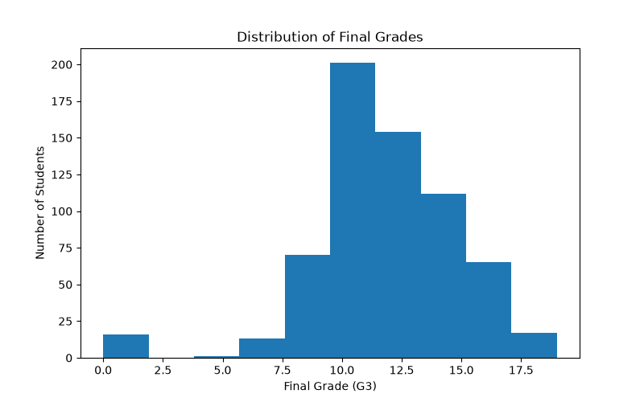
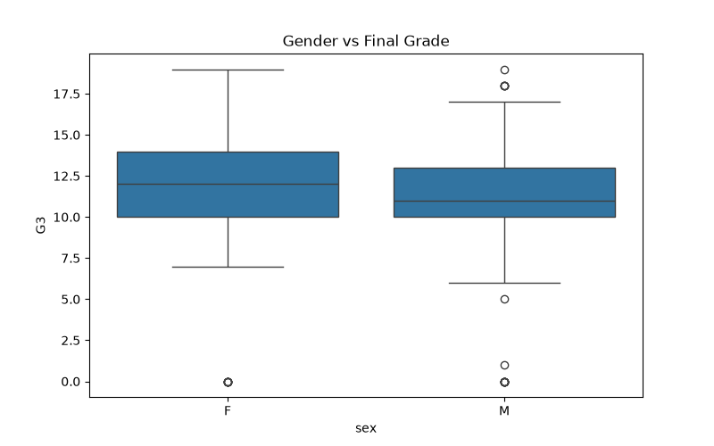
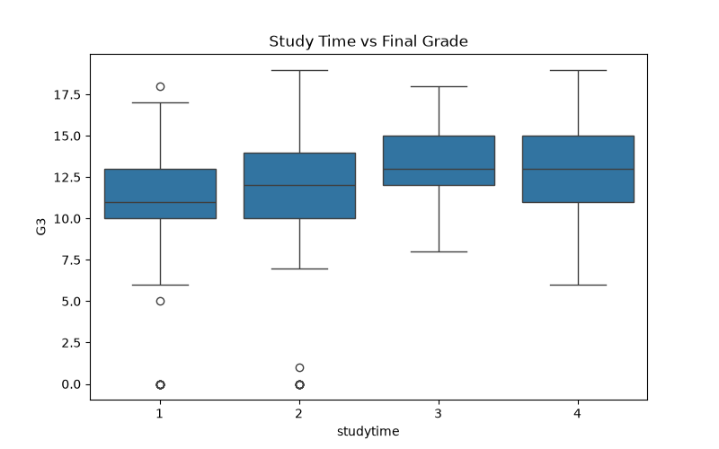
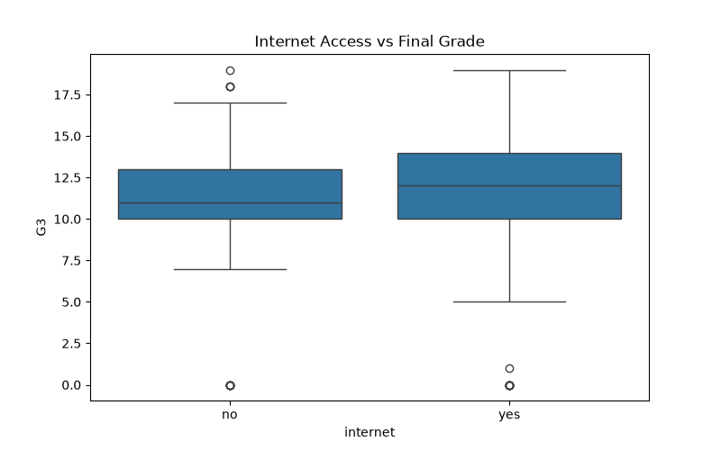
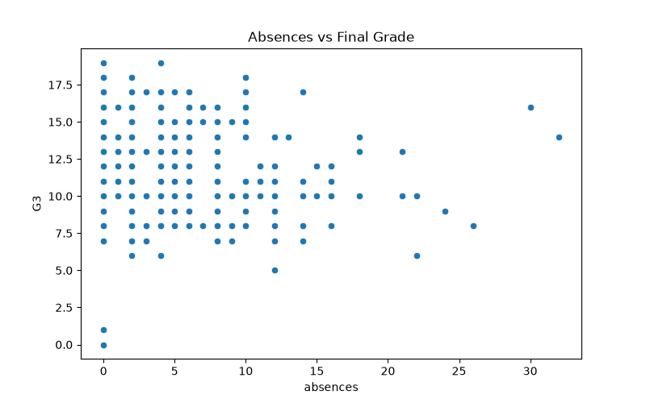

# Student Performance Analysis

## Overview

This project analyses the Student Performance Dataset using Python. The objective is to perform data cleaning, exploratory data analysis (EDA), and visualisation to identify factors affecting student academic performance.

## Tools Used

* Python
* Pandas
* Matplotlib
* Seaborn

## Data Cleaning

* Checked missing values
* Checked duplicate records
* Saved cleaned dataset

## Visualizations Info

* Final Grade Distribution
* Gender vs Final Grade
* Study Time vs Final Grade
* Internet Access vs Final Grade
* Absences vs Final Grade
* Correlation Heatmap

## Key Findings

* Students who study more generally achieve higher grades.
* Internet access has a positive impact on performance.
* Higher absenteeism is associated with lower grades.
* Previous grades are strong predictors of final grades.

## Project Structure

* Dataset files
* Python script
* Visualizations
* Report
* Presentation

## Visualizations Tab

### Final Grade Distribution

### Gender vs Final Grade

### Study Time vs Final Grade

### Internet Access vs Final Grade

### Absences vs Final Grade

### Correlation Heatmap

